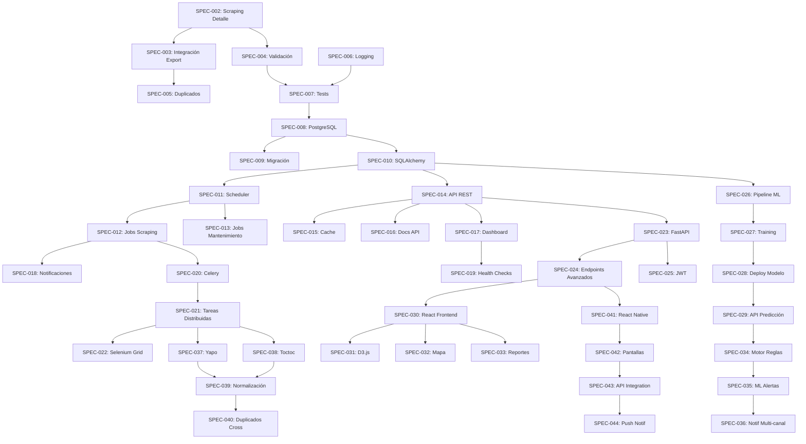

# Índice de Especificaciones - Scraper Portal Inmobiliario

**Proyecto:** scraper-portalinmobiliario  
**Última actualización:** 2026-04-09 23:58  
**Metodología:** SDD (Spec-Driven Development)

---

## Estado General

| Estado | Cantidad | Porcentaje |
|--------|----------|------------|
| Pending | 0 | 0% |
| In Progress | 0 | 0% |
| Completed | 11 | 100% |
| **Total** | **11** | **100%** |

---

## Fase 2: Mejoras (6 specs)

### Sprint 1: Scraping de Detalle

| ID | Título | Prioridad | Estimación | Estado |
|----|--------|-----------|------------|--------|
| SPEC-002 | [✅ Implementar scraping de página de detalle](./completed/SPEC-002-scraping-detalle.md) | Alta | 8h | **Completed** |
| SPEC-003 | [✅ Integrar datos de detalle en exportación](./completed/SPEC-003-integrar-datos-detalle.md) | Alta | 4h | **Completed** |

### Sprint 2: Calidad de Datos

| ID | Título | Prioridad | Estimación | Estado |
|----|--------|-----------|------------|--------|
| SPEC-004 | [✅ Sistema de validación de datos](./completed/SPEC-004-validacion-datos.md) | Alta | 6h | **Completed** |
| SPEC-005 | [✅ Detección de duplicados](./completed/SPEC-005-deteccion-duplicados.md) | Media | 4h | **Completed** |

### Sprint 3: Infraestructura

| ID | Título | Prioridad | Estimación | Estado |
|----|--------|-----------|------------|--------|
| SPEC-006 | [✅ Sistema de logging robusto](./completed/SPEC-006-logging-robusto.md) | Media | 4h | **Completed** |
| SPEC-007 | [✅ Suite de tests unitarios](./completed/SPEC-007-tests-unitarios.md) | Alta | 8h | **Completed** |

**Progreso Fase 2:** 6/6 specs completadas (100%) | 34h/34h (100%)

**Progreso Fase 3:** 5/12 specs completadas (42%) | 40h/94h (~43%)

**Total Fase 2:** 34 horas (~1.5 semanas)

---

## Fase 3: Pro (12 specs)

### Sprint 1-2: Persistencia

| ID | Título | Prioridad | Estimación | Estado |
|----|--------|-----------|------------|--------|
| SPEC-008 | [✅ Modelo de datos PostgreSQL](./completed/SPEC-008-postgres-model.md) | Crítica | 12h | **Completed** |
| SPEC-009 | [✅ Migración de datos existentes](./completed/SPEC-009-migracion-datos.md) | Alta | 6h | **Completed** |
| SPEC-010 | [✅ ORM con SQLAlchemy](./completed/SPEC-010-sqlalchemy-orm.md) | Alta | 8h | **Completed** |

### Sprint 3: Automatización

| ID | Título | Prioridad | Estimación | Estado |
|----|--------|-----------|------------|--------|
| SPEC-011 | [✅ Scheduler con APScheduler](./completed/SPEC-011-scheduler-apscheduler.md) | Alta | 8h | **Completed** |
| SPEC-012 | [✅ Jobs de scraping automático](./completed/SPEC-012-jobs-scraping-auto.md) | Alta | 6h | **Completed** |
| SPEC-013 | Jobs de mantenimiento | Media | 4h | Pending |

### Sprint 4: API y Cache

| ID | Título | Prioridad | Estimación | Estado |
|----|--------|-----------|------------|--------|
| SPEC-014 | API REST con Flask-RESTX | Alta | 12h | Pending |
| SPEC-015 | Sistema de cache con Redis | Media | 6h | Pending |
| SPEC-016 | Documentación de API (Swagger) | Media | 4h | Pending |

### Sprint 5: Monitoreo

| ID | Título | Prioridad | Estimación | Estado |
|----|--------|-----------|------------|--------|
| SPEC-017 | Dashboard de monitoreo | Alta | 16h | Pending |
| SPEC-018 | Sistema de notificaciones | Media | 8h | Pending |
| SPEC-019 | Health checks | Media | 4h | Pending |

**Total Fase 3:** 94 horas (~4.5 semanas)

---

## Fase 4: Escalamiento (21 specs)

### Sprint 1-2: Scraping Distribuido

| ID | Título | Prioridad | Estimación | Estado |
|----|--------|-----------|------------|--------|
| SPEC-020 | Celery setup y configuración | Crítica | 8h | Pending |
| SPEC-021 | Tareas distribuidas de scraping | Crítica | 12h | Pending |
| SPEC-022 | Selenium Grid para paralelización | Alta | 8h | Pending |

### Sprint 3: API FastAPI

| ID | Título | Prioridad | Estimación | Estado |
|----|--------|-----------|------------|--------|
| SPEC-023 | Migración de Flask a FastAPI | Alta | 12h | Pending |
| SPEC-024 | Endpoints avanzados | Alta | 8h | Pending |
| SPEC-025 | Autenticación JWT | Alta | 6h | Pending |

### Sprint 4-5: Machine Learning

| ID | Título | Prioridad | Estimación | Estado |
|----|--------|-----------|------------|--------|
| SPEC-026 | Pipeline de datos para ML | Alta | 8h | Pending |
| SPEC-027 | Entrenamiento de modelos | Alta | 16h | Pending |
| SPEC-028 | Deployment de modelo | Media | 6h | Pending |
| SPEC-029 | API de predicción | Alta | 8h | Pending |

### Sprint 6-7: Dashboard Avanzado

| ID | Título | Prioridad | Estimación | Estado |
|----|--------|-----------|------------|--------|
| SPEC-030 | Frontend React + TypeScript | Alta | 16h | Pending |
| SPEC-031 | Visualizaciones con D3.js | Alta | 12h | Pending |
| SPEC-032 | Mapa interactivo | Media | 8h | Pending |
| SPEC-033 | Reportes personalizados | Media | 8h | Pending |

### Sprint 8: Alertas Inteligentes

| ID | Título | Prioridad | Estimación | Estado |
|----|--------|-----------|------------|--------|
| SPEC-034 | Motor de reglas | Alta | 8h | Pending |
| SPEC-035 | Integración con ML | Alta | 6h | Pending |
| SPEC-036 | Notificaciones multi-canal | Media | 6h | Pending |

### Sprint 9-10: Multi-Plataforma

| ID | Título | Prioridad | Estimación | Estado |
|----|--------|-----------|------------|--------|
| SPEC-037 | Scraper de Yapo | Media | 10h | Pending |
| SPEC-038 | Scraper de Toctoc | Media | 10h | Pending |
| SPEC-039 | Normalización cross-platform | Alta | 8h | Pending |
| SPEC-040 | Detección de duplicados cross-platform | Media | 6h | Pending |

### Sprint 11-12: Mobile App (Opcional)

| ID | Título | Prioridad | Estimación | Estado |
|----|--------|-----------|------------|--------|
| SPEC-041 | Setup React Native | Baja | 16h | Pending |
| SPEC-042 | Pantallas principales | Baja | 32h | Pending |
| SPEC-043 | Integración con API | Baja | 16h | Pending |
| SPEC-044 | Push notifications | Baja | 12h | Pending |

**Total Fase 4:** 241 horas (~11 semanas)

---

## Resumen por Fase

| Fase | Specs | Horas | Semanas | Progreso |
|------|-------|-------|---------|----------|
| Fase 2: Mejoras | 6 | 34h | 1.5 | 6/6 specs (100%) |
| Fase 3: Pro | 12 | 94h | 4.5 | 5/12 specs (42%) |
| Fase 4: Escalamiento | 21 | 241h | 11 | 0/21 specs (0%) |
| **Total** | **39** | **369h** | **17** | **11/39 specs (28%)** |

---

## Dependencias entre Specs

---

## Próximos Pasos

1. **Revisar y aprobar** PRDs de cada fase
2. **Priorizar** specs de Fase 2 para inicio inmediato
3. **Asignar** recursos y equipo
4. **Ejecutar** con `/cascade-dev` o implementación manual
5. **Validar** cada spec antes de marcar como completada
6. **Actualizar** este índice conforme avance el proyecto

---

## Referencias

- [PRD Fase 2](../../../docs/specs/PRD-FASE-2-MEJORAS.md)
- [PRD Fase 3](../../../docs/specs/PRD-FASE-3-PRO.md)
- [PRD Fase 4](../../../docs/specs/PRD-FASE-4-ESCALAMIENTO.md)
- [SDD Methodology](../../../../SDD-jard/docs/SDD-METHODOLOGY.md)
- [Spec Templates](../../../../SDD-jard/docs/SPEC-TEMPLATES.md)

---

**Mantenido por:** AI Dev Team  
**Actualización automática:** Cada vez que se crea/completa una spec
