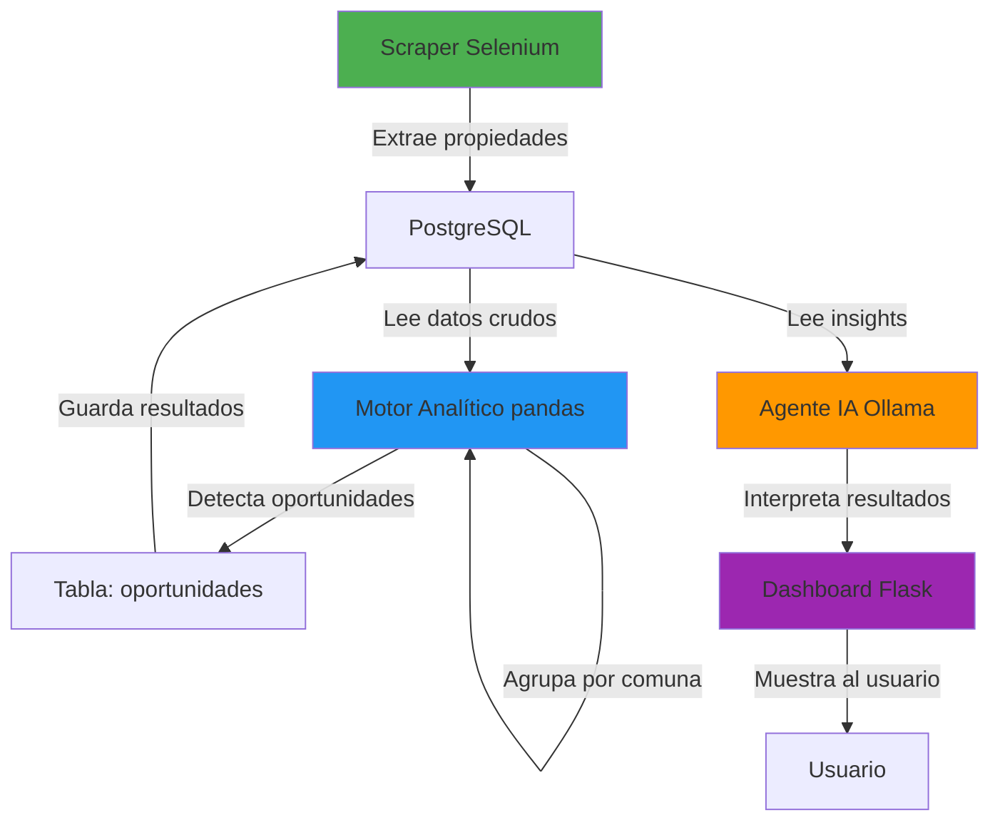

# 🎯 Portal Inmobiliario Scraper - Arquitectura MVP

**Versión:** 1.0  
**Fecha:** Abril 2026  
**Objetivo:** MVP funcional con analítica básica, un solo contenedor Docker, y agente IA ligero

---

## 📋 Resumen Ejecutivo

Este documento define la arquitectura MVP del Portal Inmobiliario Scraper, optimizada para:

- **Recursos limitados:** Un solo contenedor Docker
- **Simplicidad:** PostgreSQL embebido en el mismo contenedor
- **Velocidad:** Implementación rápida sin sobreingeniería
- **Escalabilidad futura:** Diseño preparado para evolucionar

---

## 🎯 Objetivo del MVP

Construir una versión mínima pero funcional que:

✅ Ejecute scraping automatizado  
✅ Procese datos con analítica básica (pandas)  
✅ Detecte oportunidades simples de inversión  
✅ Almacene todo en PostgreSQL  
✅ Exponga resultados en un dashboard básico  
✅ Integre un agente IA ligero para interpretación  

---

## ⚙️ Restricciones CRÍTICAS (OBLIGATORIAS)

🔒 **Usar UN SOLO contenedor Docker**  
🔒 **Incluir PostgreSQL dentro del mismo contenedor**  
🔒 **Optimizar uso de CPU y RAM**  
🔒 **Evitar arquitecturas distribuidas**  
🔒 **Evitar sobreingeniería**  
🔒 **Priorizar velocidad de implementación sobre perfección**  

---

## 🏗️ Arquitectura MVP (SIMPLE Y EFICIENTE)

### Stack Completo en UN Solo Contenedor

```
┌─────────────────────────────────────────────────────┐
│         CONTENEDOR DOCKER ÚNICO                     │
│                                                     │
│  ┌──────────────────────────────────────────────┐  │
│  │  Aplicación Python (Flask)                   │  │
│  │  - Dashboard Web                             │  │
│  │  - API REST                                  │  │
│  │  - Scheduler (APScheduler)                   │  │
│  └──────────────────────────────────────────────┘  │
│                      ↓                              │
│  ┌──────────────────────────────────────────────┐  │
│  │  Scraper (Selenium + Chrome)                 │  │
│  │  - Extracción de propiedades                 │  │
│  │  - Navegación automática                     │  │
│  └──────────────────────────────────────────────┘  │
│                      ↓                              │
│  ┌──────────────────────────────────────────────┐  │
│  │  Motor Analítico (pandas)                    │  │
│  │  - Normalización de datos                    │  │
│  │  - Cálculo de precio/m²                      │  │
│  │  - Agrupación por comuna                     │  │
│  │  - Detección de oportunidades                │  │
│  └──────────────────────────────────────────────┘  │
│                      ↓                              │
│  ┌──────────────────────────────────────────────┐  │
│  │  PostgreSQL (local)                          │  │
│  │  - Almacenamiento de propiedades             │  │
│  │  - Resultados de analítica                   │  │
│  │  - Jobs del scheduler                        │  │
│  └──────────────────────────────────────────────┘  │
│                      ↓                              │
│  ┌──────────────────────────────────────────────┐  │
│  │  Agente IA (Ollama - Opcional)               │  │
│  │  - Modelo: qwen2.5-coder:1.5b                │  │
│  │  - Interpretación de insights                │  │
│  │  - Chat básico                               │  │
│  └──────────────────────────────────────────────┘  │
└─────────────────────────────────────────────────────┘
```

---

## 🔁 Flujo de Datos MVP



### Pasos del Flujo

1. **Scraper** obtiene propiedades desde portalinmobiliario.com
2. **Datos se almacenan** en PostgreSQL (tabla `properties`)
3. **Proceso con pandas:**
   - Normaliza datos (limpieza, conversión de tipos)
   - Calcula precio/m² por propiedad
   - Agrupa por comuna y calcula promedios
   - Identifica outliers y tendencias
4. **Detecta oportunidades simples:**
   - Propiedades con precio/m² < promedio - 1 desviación estándar
   - Propiedades con características premium a precio bajo
5. **Guarda resultados** en tabla `opportunities`
6. **Agente IA** SOLO interpreta estos resultados (NO procesa datos crudos)
7. **Dashboard** muestra propiedades, oportunidades y métricas

---

## 🧠 Principios del MVP

| Principio | Descripción |
|-----------|-------------|
| **Pandas hace toda la analítica** | No usar ML complejo, solo estadística descriptiva |
| **PostgreSQL almacena datos y resultados** | Base de datos única para todo |
| **El LLM NO procesa datos crudos** | Solo interpreta insights ya calculados |
| **El agente responde usando insights** | Consultas SQL simples + explicación en lenguaje natural |
| **Todo debe ser simple, directo y funcional** | Evitar abstracciones innecesarias |

---

## 🤖 Agente IA (LIVIANO)

### Modelo Recomendado

**Modelo principal:** `qwen2.5-coder:1.5b`

- **Tamaño:** 1.5B parámetros (~900MB)
- **RAM requerida:** ~2GB
- **Velocidad:** ~50 tokens/seg en CPU moderna
- **Ventajas:** Rápido, eficiente, bueno para código y análisis

### Funciones del Agente

✅ **Responder preguntas simples:**
- "¿Cuáles son las mejores oportunidades en Santiago?"
- "¿Cuál es el precio promedio por m² en Las Condes?"
- "¿Qué comunas tienen más propiedades bajo el promedio?"

✅ **Explicar oportunidades detectadas:**
- "Esta propiedad está 25% bajo el promedio de la comuna"
- "El precio/m² es $X, mientras el promedio es $Y"

❌ **NO ejecutar cálculos:**
- El agente NO calcula precio/m²
- El agente NO agrupa datos
- El agente NO hace queries complejas

### Integración con Ollama

```python
import requests

def ask_agent(question: str, context: dict) -> str:
    """
    Consulta al agente IA con contexto de oportunidades.
    
    Args:
        question: Pregunta del usuario
        context: Diccionario con insights ya calculados
        
    Returns:
        Respuesta del agente
    """
    prompt = f"""
    Eres un asistente de analítica inmobiliaria.
    
    Contexto (insights ya calculados):
    {context}
    
    Pregunta del usuario:
    {question}
    
    Responde de forma concisa y clara.
    """
    
    response = requests.post(
        "http://localhost:11434/api/generate",
        json={
            "model": "qwen2.5-coder:1.5b",
            "prompt": prompt,
            "stream": False
        }
    )
    
    return response.json()["response"]
```

---

## 📊 Analítica Mínima Requerida

### Métricas Básicas (Implementar SOLO estas)

| Métrica | Descripción | Implementación |
|---------|-------------|----------------|
| **Precio promedio por comuna** | Media aritmética de precios | `df.groupby('comuna')['precio'].mean()` |
| **Precio por m²** | Precio / superficie útil | `df['precio'] / df['superficie_util']` |
| **Precio/m² promedio por comuna** | Media de precio/m² por comuna | `df.groupby('comuna')['precio_m2'].mean()` |
| **Propiedades bajo promedio** | Precio/m² < promedio - 1σ | `df[df['precio_m2'] < (mean - std)]` |
| **Distribución por tipo** | Conteo de propiedades por tipo | `df['tipo'].value_counts()` |

### Evitar en esta Fase

❌ Modelos de Machine Learning  
❌ Feature engineering avanzado  
❌ Predicción de precios  
❌ Clustering geográfico  
❌ Análisis de series temporales  
❌ Scoring complejo  

---

## 🗄️ Base de Datos (PostgreSQL dentro del contenedor)

### Tablas Mínimas

#### 1. `properties` (Propiedades scrapeadas)

```sql
CREATE TABLE properties (
    id VARCHAR(50) PRIMARY KEY,
    titulo TEXT NOT NULL,
    precio NUMERIC,
    precio_moneda VARCHAR(10),
    ubicacion TEXT,
    comuna VARCHAR(100),
    sector VARCHAR(100),
    tipo VARCHAR(50),
    operacion VARCHAR(50),
    dormitorios INTEGER,
    banos INTEGER,
    superficie_util NUMERIC,
    superficie_total NUMERIC,
    precio_m2 NUMERIC,  -- Calculado por pandas
    url TEXT,
    descripcion TEXT,
    fecha_publicacion DATE,
    fecha_scraping TIMESTAMP DEFAULT CURRENT_TIMESTAMP,
    created_at TIMESTAMP DEFAULT CURRENT_TIMESTAMP,
    updated_at TIMESTAMP DEFAULT CURRENT_TIMESTAMP
);

CREATE INDEX idx_properties_comuna ON properties(comuna);
CREATE INDEX idx_properties_tipo ON properties(tipo);
CREATE INDEX idx_properties_operacion ON properties(operacion);
CREATE INDEX idx_properties_precio_m2 ON properties(precio_m2);
```

#### 2. `opportunities` (Oportunidades detectadas)

```sql
CREATE TABLE opportunities (
    id SERIAL PRIMARY KEY,
    property_id VARCHAR(50) REFERENCES properties(id),
    tipo_oportunidad VARCHAR(50),  -- 'bajo_promedio', 'premium_barato', etc.
    score NUMERIC,  -- Qué tan buena es la oportunidad (0-100)
    precio_m2_propiedad NUMERIC,
    precio_m2_promedio_comuna NUMERIC,
    diferencia_porcentual NUMERIC,
    razon TEXT,  -- Explicación de por qué es oportunidad
    created_at TIMESTAMP DEFAULT CURRENT_TIMESTAMP
);

CREATE INDEX idx_opportunities_property ON opportunities(property_id);
CREATE INDEX idx_opportunities_score ON opportunities(score DESC);
```

#### 3. `analytics_cache` (Cache de métricas)

```sql
CREATE TABLE analytics_cache (
    id SERIAL PRIMARY KEY,
    metric_name VARCHAR(100) UNIQUE,
    metric_value JSONB,
    calculated_at TIMESTAMP DEFAULT CURRENT_TIMESTAMP
);
```

### No Agregar Complejidad Innecesaria

❌ Tablas de usuarios (usar auth simple en Flask)  
❌ Tablas de auditoría (usar logs)  
❌ Tablas de configuración (usar .env)  
❌ Tablas de notificaciones (implementar después)  

---

## 🖥️ Dashboard MVP

### Páginas Mínimas

#### 1. **Home / Dashboard**
- KPIs principales (total propiedades, precio promedio, oportunidades)
- Gráfico de distribución por comuna
- Tabla de últimas propiedades scrapeadas

#### 2. **Oportunidades**
- Lista de oportunidades detectadas
- Filtros: comuna, tipo, score mínimo
- Ordenar por: score, precio, fecha

#### 3. **Analítica**
- Métricas por comuna (tabla)
- Gráfico de precio/m² por comuna
- Distribución de propiedades por tipo

#### 4. **Chat IA** (Secundario)
- Input de pregunta
- Respuesta del agente
- Historial de conversación (en memoria, no persistir)

### Tecnologías

- **Backend:** Flask 3.0.2
- **Frontend:** HTML + TailwindCSS + Alpine.js (sin framework pesado)
- **Gráficos:** Chart.js (ligero)
- **Tablas:** DataTables.js (interactivas)

---

## 🚀 Estrategia de Implementación

### Priorización (En este orden)

1. ✅ **Docker funcional (todo en un contenedor)**
   - Dockerfile con PostgreSQL + Python + Chrome
   - Entrypoint que inicia PostgreSQL y Flask
   
2. ✅ **Scraper funcionando**
   - Ya implementado con Selenium
   - Validar que guarda en PostgreSQL
   
3. ✅ **Persistencia en PostgreSQL**
   - Crear tablas `properties` y `opportunities`
   - Migrar datos existentes
   
4. 🚧 **Pipeline pandas simple**
   - Script `analytics.py` con funciones básicas
   - Calcular precio/m², promedios por comuna
   
5. 🚧 **Detección básica de oportunidades**
   - Función `detect_opportunities()` en `analytics.py`
   - Guardar en tabla `opportunities`
   
6. ✅ **Visualización en dashboard**
   - Ya existe dashboard Flask
   - Agregar página de oportunidades
   
7. 🚧 **Integración mínima con LLM**
   - Endpoint `/api/chat` en Flask
   - Consultar Ollama con contexto de oportunidades

### Cronograma Estimado

| Fase | Tiempo | Estado |
|------|--------|--------|
| 1. Docker único | 1 día | 🚧 Pendiente |
| 2. Scraper validado | 0.5 días | ✅ Completado |
| 3. PostgreSQL setup | 0.5 días | ✅ Completado |
| 4. Pipeline pandas | 1 día | 🚧 Pendiente |
| 5. Detección oportunidades | 1 día | 🚧 Pendiente |
| 6. Dashboard actualizado | 1 día | 🚧 Pendiente |
| 7. Integración LLM | 1 día | 🚧 Pendiente |
| **TOTAL** | **6 días** | |

---

## ⚠️ Evitar en el MVP

| ❌ NO Implementar | ✅ Implementar Después |
|-------------------|------------------------|
| Microservicios | Fase 4 - Escalamiento |
| Múltiples contenedores | Fase 4 - Escalamiento |
| Sistemas distribuidos | Fase 4 - Escalamiento |
| ML complejo | Fase 4 - Escalamiento |
| Feature engineering avanzado | Fase 4 - Escalamiento |
| Orquestadores tipo Celery | Fase 3 - Pro |
| Sobrecarga de métricas | Fase 3 - Pro |
| Cache distribuido (Redis) | Fase 3 - Pro |
| Message queues | Fase 4 - Escalamiento |
| Kubernetes | Fase 4 - Escalamiento |

---

## 🔮 Preparación para Escalabilidad Futura

### Diseño Pensando en el Futuro

Aunque el MVP es simple, el código debe permitir:

1. **Separar PostgreSQL en otro contenedor**
   - Usar `DATABASE_URL` desde variables de entorno
   - No hardcodear conexiones
   
2. **Reemplazar pandas por pipelines más robustos**
   - Abstraer lógica de analítica en módulo `analytics.py`
   - Interfaces claras entre componentes
   
3. **Mejorar el agente IA**
   - Usar modelos más grandes cuando haya más recursos
   - Implementar RAG (Retrieval-Augmented Generation)
   
4. **Agregar más métricas y scoring**
   - Diseño modular de métricas
   - Fácil agregar nuevas sin romper existentes

### Principios de Diseño

- **Configuración por variables de entorno:** Todo configurable sin cambiar código
- **Módulos desacoplados:** Scraper, Analytics, Dashboard independientes
- **Interfaces claras:** Contratos bien definidos entre componentes
- **Logging exhaustivo:** Facilita debugging y monitoreo futuro

---

## 🧩 Entregables Esperados

### 1. Configuración Docker Funcional (Single Container)

**Archivo:** `Dockerfile.mvp`

```dockerfile
FROM python:3.11-slim

# Instalar PostgreSQL + Chrome + Python deps
RUN apt-get update && apt-get install -y \
    postgresql postgresql-contrib \
    wget gnupg ca-certificates \
    google-chrome-stable \
    && rm -rf /var/lib/apt/lists/*

# Copiar código
WORKDIR /app
COPY requirements.txt .
RUN pip install --no-cache-dir -r requirements.txt
COPY . .

# Script de inicio (PostgreSQL + Flask)
COPY entrypoint-mvp.sh /entrypoint.sh
RUN chmod +x /entrypoint.sh

EXPOSE 5000
ENTRYPOINT ["/entrypoint.sh"]
```

**Archivo:** `entrypoint-mvp.sh`

```bash
#!/bin/bash
set -e

# Iniciar PostgreSQL
service postgresql start

# Esperar a que PostgreSQL esté listo
until pg_isready -U postgres; do
  sleep 1
done

# Crear base de datos si no existe
su - postgres -c "psql -c \"CREATE DATABASE portalinmobiliario;\" || true"

# Ejecutar migraciones
python -m alembic upgrade head

# Iniciar Flask
exec python app.py
```

### 2. Arquitectura Simplificada

**Diagrama de componentes:**

```
┌─────────────────────────────────────────┐
│  Flask App (app.py)                     │
│  ├── /                (Dashboard)       │
│  ├── /oportunidades   (Oportunidades)   │
│  ├── /analytics       (Métricas)        │
│  └── /api/chat        (Agente IA)       │
└─────────────────────────────────────────┘
              ↓
┌─────────────────────────────────────────┐
│  Analytics Module (analytics.py)        │
│  ├── calculate_price_per_m2()           │
│  ├── get_avg_by_comuna()                │
│  ├── detect_opportunities()             │
│  └── cache_metrics()                    │
└─────────────────────────────────────────┘
              ↓
┌─────────────────────────────────────────┐
│  Database (database.py)                 │
│  ├── properties                         │
│  ├── opportunities                      │
│  └── analytics_cache                    │
└─────────────────────────────────────────┘
```

### 3. Flujo de Datos Claro

Ver sección "🔁 Flujo de Datos MVP" arriba.

### 4. Pipeline Pandas Mínimo

**Archivo:** `analytics.py`

```python
import pandas as pd
from database import get_session
from models import Property, Opportunity

def calculate_price_per_m2():
    """Calcula precio/m² para todas las propiedades."""
    session = get_session()
    properties = session.query(Property).all()
    
    for prop in properties:
        if prop.superficie_util and prop.precio:
            prop.precio_m2 = prop.precio / prop.superficie_util
    
    session.commit()
    session.close()

def get_avg_by_comuna():
    """Obtiene precio/m² promedio por comuna."""
    session = get_session()
    
    df = pd.read_sql(
        "SELECT comuna, AVG(precio_m2) as avg_precio_m2 FROM properties GROUP BY comuna",
        session.bind
    )
    
    session.close()
    return df.to_dict('records')

def detect_opportunities():
    """Detecta oportunidades de inversión."""
    session = get_session()
    
    # Leer datos
    df = pd.read_sql("SELECT * FROM properties WHERE precio_m2 IS NOT NULL", session.bind)
    
    # Calcular estadísticas por comuna
    stats = df.groupby('comuna')['precio_m2'].agg(['mean', 'std']).reset_index()
    
    # Detectar oportunidades (precio < promedio - 1 desviación estándar)
    opportunities = []
    for _, row in df.iterrows():
        comuna_stats = stats[stats['comuna'] == row['comuna']].iloc[0]
        threshold = comuna_stats['mean'] - comuna_stats['std']
        
        if row['precio_m2'] < threshold:
            diff_pct = ((comuna_stats['mean'] - row['precio_m2']) / comuna_stats['mean']) * 100
            
            opp = Opportunity(
                property_id=row['id'],
                tipo_oportunidad='bajo_promedio',
                score=min(100, diff_pct * 2),  # Score simple
                precio_m2_propiedad=row['precio_m2'],
                precio_m2_promedio_comuna=comuna_stats['mean'],
                diferencia_porcentual=diff_pct,
                razon=f"Precio/m² {diff_pct:.1f}% bajo el promedio de {row['comuna']}"
            )
            opportunities.append(opp)
    
    # Guardar oportunidades
    session.bulk_save_objects(opportunities)
    session.commit()
    session.close()
    
    return len(opportunities)
```

### 5. Definición de Tablas

Ver sección "🗄️ Base de Datos" arriba.

### 6. Integración Básica con LLM

Ver sección "🤖 Agente IA" arriba.

---

## 📈 Métricas de Éxito del MVP

| Métrica | Objetivo | Medición |
|---------|----------|----------|
| **Tiempo de build Docker** | < 5 minutos | `time docker build` |
| **Uso de RAM** | < 2GB | `docker stats` |
| **Uso de CPU** | < 50% en idle | `docker stats` |
| **Tiempo de scraping** | < 2 min por 50 propiedades | Logs |
| **Tiempo de analítica** | < 10 seg para 1000 propiedades | Logs |
| **Tiempo de respuesta dashboard** | < 1 seg | Browser DevTools |
| **Tiempo de respuesta agente IA** | < 5 seg | Browser DevTools |

---

## 🔧 Comandos Útiles

### Build y Run del MVP

```bash
# Build de imagen MVP
docker build -f Dockerfile.mvp -t portalinmobiliario:mvp .

# Run del contenedor
docker run -d \
  --name scraper-mvp \
  -p 5000:5000 \
  -v $(pwd)/output:/app/output \
  portalinmobiliario:mvp

# Ver logs
docker logs -f scraper-mvp

# Acceder al contenedor
docker exec -it scraper-mvp bash

# Conectar a PostgreSQL dentro del contenedor
docker exec -it scraper-mvp psql -U postgres -d portalinmobiliario
```

### Testing del MVP

```bash
# Test de scraping
docker exec scraper-mvp python main.py --operacion venta --tipo departamento --max-pages 1

# Test de analítica
docker exec scraper-mvp python -c "from analytics import detect_opportunities; print(detect_opportunities())"

# Test de agente IA
curl -X POST http://localhost:5000/api/chat \
  -H "Content-Type: application/json" \
  -d '{"question": "¿Cuáles son las mejores oportunidades?"}'
```

---

## 🎓 Conclusión

Este MVP prioriza:

✅ **Rapidez:** 6 días de implementación  
✅ **Simplicidad:** Un solo contenedor, sin microservicios  
✅ **Funcionalidad:** Scraping + Analítica + Dashboard + IA  
✅ **Eficiencia:** < 2GB RAM, < 50% CPU  
✅ **Escalabilidad:** Diseño modular para crecer después  

**Actúa como un ingeniero pragmático:** Implementa lo mínimo necesario para tener un producto funcional, sin perder la capacidad de escalar el sistema más adelante.

---

**Próximos pasos:** Ver `docs/specs/SPEC-MVP-001.md` para la especificación técnica detallada de implementación.
